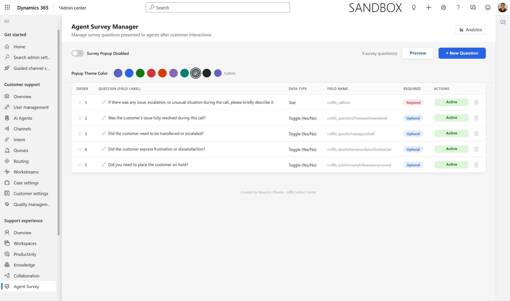
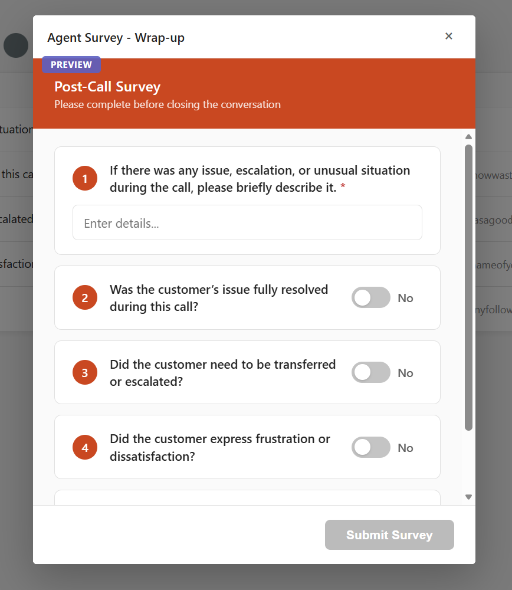
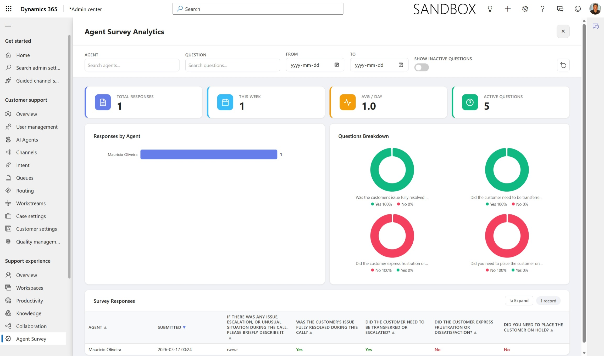

# Agent Survey for Dynamics 365 Contact Center

A lightweight, no-code survey solution for Dynamics 365 Contact Center that automatically presents agents with a configurable survey popup during conversation wrap-up.



## Solution Components

The solution is composed of the following Dataverse components:

### Custom Table: Agent Survey Form

**Logical name:** `crd9b_agentsurveyform`

This is the central table that stores all survey responses. Each row represents one completed survey submitted by an agent after a conversation wrap-up.

| Column | Logical Name | Type | Purpose |
|--------|-------------|------|---------|
| Agent Survey Form ID | `crd9b_agentsurveyformid` | Primary Key | Unique identifier for each survey response |
| Conversation ID (Lookup) | `crd9b_conversationid` | Lookup → `msdyn_ocliveworkitem` | Links the survey response to the original Omnichannel conversation |
| Conversation ID (Text) | `crd9b_newconversationid` | String | Stores the conversation GUID as plain text (fallback for cross-entity queries) |
| Recording URL | `crd9b_recordingurl` | String | Optional field for storing call recording URLs |
| Owner | `ownerid` | Lookup → `systemuser` | The agent who submitted the survey (set automatically) |
| Created On | `createdon` | DateTime | Timestamp of when the survey was submitted |

**Dynamic survey columns** — When you add questions through the Survey Manager, new columns are dynamically created on this table (e.g., `crd9b_wasthisagoodcall` as a Boolean, `crd9b_additionalcomments` as a Memo). These columns are managed entirely through the Survey Manager UI — no manual column creation is needed.

#### How Metadata Works

The solution stores configuration in Dataverse metadata fields (no extra config tables needed):

- **Entity Description** — The table's own `Description` field stores global config as JSON:
  ```json
  { "surveyEnabled": true, "themeColor": "#5B5FC7" }
  ```
  This controls whether the survey popup is globally enabled and the theme color of the popup header.

- **Field Descriptions** — Each survey question column stores its survey metadata in the column's `Description` field as JSON:
  ```json
  { "survey": true, "active": true, "order": 1, "mandatory": false }
  ```
  This controls whether the field appears in the survey, its display order, and whether it's required.

### Web Resources

| File | Web Resource Name | Type | Description |
|------|-------------------|------|-------------|
| `AgentSurveyWrapup.js` | `crd9b_/scripts/AgentSurveyWrapup.js` | JScript | Form script registered on the **Active Conversation** form. Polls for conversations in wrap-up status and triggers the survey popup dialog. Includes a three-layer duplicate prevention mechanism (window.top, localStorage, and database check) |
| `new_AgentSurveyForm.htm` | `new_AgentSurveyForm` | HTML | The survey popup form shown to agents. Dynamically loads active question columns from the entity metadata, renders them as toggle switches or text inputs, validates mandatory fields, and creates a new row in the Agent Survey Form table on submit |
| `new_SurveyQuestionManager.htm` | `new_SurveyQuestionManager` | HTML | The admin interface. Allows creating/editing/deleting survey questions, drag-and-drop reordering, toggling active/inactive and required/optional status, setting the popup theme color, previewing the survey, and an analytics dashboard with KPIs, agent breakdown charts, donut charts, and a filterable response table |

### Process (Cloud Flow)

The solution includes a process component associated with the entity. This is automatically created by Dataverse when the table is set up and is used for standard entity operations.

## Features

- **Dynamic Survey Questions** — Add, edit, reorder, and toggle questions without code changes
- **Multiple Field Types** — Toggle (Yes/No), Text, Number, Date, Email, Decimal, Multi-line Text
- **Theme Customization** — Choose from preset colors or pick a custom theme for the survey popup
- **Global Enable/Disable** — Turn the survey popup on or off across the entire organization
- **Mandatory Questions** — Mark questions as required with real-time validation
- **Analytics Dashboard** — Built-in analytics with KPIs, agent breakdown charts, donut charts for toggle questions, and a filterable response table
- **Multi-Agent Filter** — Filter analytics by agent, question, and date range
- **Duplicate Prevention** — Three-layer guard (window.top, localStorage, database) prevents duplicate surveys
- **Environment Portable** — Uses `EntityDefinitions(LogicalName=...)` alternate key instead of hardcoded GUIDs
- **Zero Config Tables** — All configuration is stored in Dataverse metadata (entity and field descriptions) so there's no need for separate configuration tables

## Survey Popup

When an agent's conversation enters wrap-up status, the survey popup automatically appears:



## Analytics Dashboard

The built-in analytics dashboard provides real-time insights into survey responses, including KPIs, agent breakdown charts, question-level donut charts, and a filterable response table:



## Setup Guide

### Prerequisites

- A Dynamics 365 Customer Service environment with the Contact Center (Omnichannel) module
- System Administrator or System Customizer security role
- An unmanaged solution in your environment to hold the components

### Step 1: Create the Custom Entity

1. Open [Power Apps](https://make.powerapps.com) and select your environment
2. Go to **Tables** (under **Dataverse**) and click **+ New table**
3. Create a table with display name **Agent Survey Form** (logical name: `crd9b_agentsurveyform`)
   > **Note:** The `crd9b_` prefix depends on your publisher. If your publisher uses a different prefix, update the `SURVEY_ENTITY` / `SURVEY_ENTITY_NAME` variable in all three files to match
4. Add the following columns to the table:
   - **Conversation ID** — Type: **Lookup** → Conversation (`msdyn_ocliveworkitem`)
   - **New Conversation ID** — Type: **Single line of text** (stores the conversation GUID as text)
   - **Recording URL** — Type: **Single line of text** (optional, for call recording links)
5. Save and publish the table

### Step 2: Import the Web Resources

1. Open [Power Apps](https://make.powerapps.com) and select your environment
2. Go to **Solutions** and open your unmanaged solution
3. Click **+ Add existing** → **More** → **Web resource** if they already exist, or create new ones:
   - Click **+ New** → **More** → **Web resource**
   - For each file, set:
     - **AgentSurveyWrapup.js** — Name: `crd9b_/scripts/AgentSurveyWrapup.js`, Type: `Script (JScript)`
     - **new_AgentSurveyForm.htm** — Name: `new_AgentSurveyForm`, Type: `Webpage (HTML)`
     - **new_SurveyQuestionManager.htm** — Name: `new_SurveyQuestionManager`, Type: `Webpage (HTML)`
   - Upload each file and click **Save**, then **Publish**

### Step 3: Register the Script on the Active Conversation Form

This step makes the survey popup appear automatically when agents wrap up conversations.

1. Open [Power Apps](https://make.powerapps.com) → **Solutions** → open your solution
2. Click **+ Add existing** → **Entity** → search for **Conversation** (`msdyn_ocliveworkitem`) and add it
3. Open the **Conversation** entity → **Forms**
4. Open the **Active Conversation** form (or the form used by your agents)
5. Go to **Form Properties** (or click the **Events** tab in the modern form designer):
   - Under **Form Libraries**, click **+ Add library**
   - Search for `crd9b_/scripts/AgentSurveyWrapup.js` and add it
6. Under **Event Handlers**, on the **OnLoad** event:
   - Click **+ Add Event Handler**
   - Library: `crd9b_/scripts/AgentSurveyWrapup.js`
   - Function: `AgentSurveyWrapup.onLoad`
   - Check **Pass execution context as first parameter**
   - Click **Done**
7. Click **Save and Publish**

### Step 4: Open the Survey Manager

The Survey Manager is where you configure questions, set the theme, and view analytics.

1. Open the **Customer Service Admin Center** app in your D365 environment:
   - Navigate to `https://[your-org].crm.dynamics.com/main.aspx`
   - From the app switcher (top-left), select **Customer Service Admin Center**
2. You can open the Survey Manager web resource directly via URL:
   ```
   https://[your-org].crm.dynamics.com/WebResources/new_SurveyQuestionManager
   ```
   Replace `[your-org]` with your organization's subdomain (e.g., `mycompany`)
3. Alternatively, add it as a **Sitemap entry** for easy access:
   - In your solution, go to **Model-driven Apps** → open your app (e.g., Customer Service Admin Center or Customer Service Workspace)
   - Open the **Site Map** editor
   - Add a new **Sub Area** with:
     - Type: **Web Resource**
     - Web Resource: `new_SurveyQuestionManager`
     - Title: `Survey Manager`
   - Save and publish the app

### Step 5: Configure Your Survey

Once the Survey Manager is open:

1. **Enable the survey** — Toggle the global switch at the top to enable the survey popup
2. **Add questions** — Click **+ New Question**, enter the question text, choose a data type, and optionally mark it as required
3. **Set the theme** — Pick a color from the swatches or choose a custom color for the survey popup header
4. **Preview** — Click **Preview** to see how the survey will look to agents
5. **Reorder** — Drag and drop questions in the table to change their order
6. **Analytics** — Click the **Analytics** button to view the dashboard with response data, agent breakdowns, and question charts

## Author

Created by [Mauricio Oliveira](https://www.linkedin.com/in/mauriciooliveira/) — GBB Contact Center
